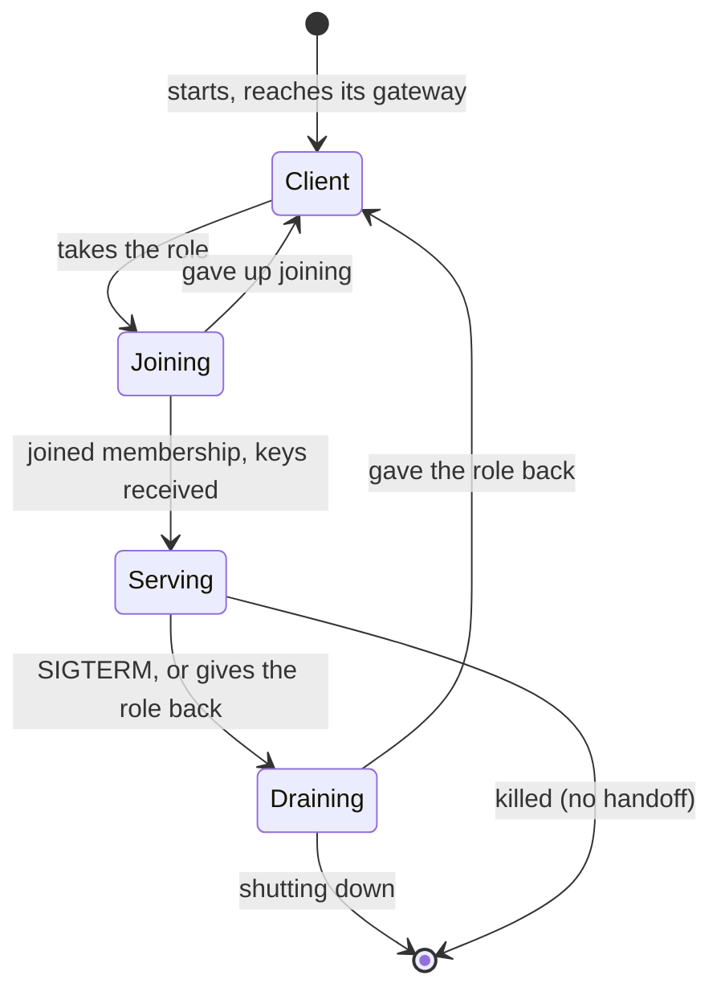

# Design: an infrastructure DHT

A store built into the Henge cluster itself: some of its processes hold the [ephemeral store](../ephemeral-store.md),
so the cluster runs no separate system. It is a distributed hash table, but an *infrastructure* one. It runs on a
network the operator owns, among processes the operator deployed, and nearly every design choice of a public
peer-to-peer DHT is made differently because of that.

Holding the store is **a role**, not something every process does. A process takes it on when the store needs
more capacity, drops the services it doesn't have to run, and gives the role back when the store has more than it
needs. A key that gets hot enough is given **a home of its own**: one store node and its backups. So the store, and
the network traffic it causes, is as big as the cluster's load needs and no bigger.

**Status. Superseded** by [a store of sub-clusters](subcluster-store.md), which keeps this design's store
nodes, gateways, lifecycle, hard failures, lineage epoch and minority rule, and replaces the hashing with a
gossiped directory of key families. This document is kept for those parts, which the new one refers to, and for
the reasoning that led there.

## Why it differs from a peer-to-peer DHT

| | Public P2P (Kademlia, Chord) | Infrastructure (this) |
|---|---|---|
| Peers | Untrusted, Sybil attacks | Trusted, the same security model as `/_henge`: network isolation |
| Who stores | Every peer | **Store nodes: a role taken on and given back, sized to the load** |
| Membership | Partial: each node knows O(log *N*) others | **Full, among store nodes** |
| A lookup | O(log *N*) hops | **At most two**: a client's gateway, then the owner |
| Placement | Hashing only | Hashing, and **a home of its own for a hot key** |
| Churn | Random, constant, abrupt | **Planned**: rolling deploys, with notice (`SIGTERM`), a few nodes at a time |
| Reachability | NAT, firewalls, asymmetric | Every node reaches every node |
| Data | Durable, must be repaired | **Ephemeral, re-asserted every heartbeat** |
| Repair | Anti-entropy, Merkle trees, read repair | **None**: the next heartbeat rewrites everything |

The last two rows are what the ephemeral contract buys. Every entry is renewed by its writer within a
heartbeat, so a replica that missed writes, or a new owner that started empty, is complete again one heartbeat
later without any repair protocol. A DHT for durable data spends most of its complexity on exactly the thing
this one gets for free.

## Decisions

- **Storing is a role.** `henge.store.type=dht` makes the cluster its own store. Each process is a **client**, or
  a **store node** that answers for keys. The role is chosen by the process ([below](#store-nodes)), or fixed by
  configuration.
- **A store node keeps only the services it has to run.** On taking the role, it gives the others up, as a node
  that loses a lease does, so that its CPU, memory and connections go to the store.
- **Clients go through a gateway.** A client talks to one store node, its gateway, which forwards to the key's
  owner. A client holds one or two connections to the store however big the cluster is.
- **Full membership among store nodes.** Each store node knows every other, and computes any key's owners
  itself. Clients don't keep the list; their gateway does.
- **Placement by XOR distance** (agreed earlier). A key's owners are the *r* store nodes whose ids are closest to
  the key's hash. Joining or leaving moves only the keys whose closest *r* include that node.
- **A hot key gets a home.** A key whose load outgrows a share of a store node is moved to a store node of its
  own and its backups ([below](#homes-for-hot-keys)). The home is recorded in the store, and overrides the hash.
- **Redundant: *r* copies, default 3** (agreed earlier: the *k* closest). Copies merge by the contract's own
  rules: members by union, buckets by maximum.
- **No repair protocol.** Heartbeats are the repair.
- **Writes outside responsibility are accepted** (agreed earlier). A store node whose view is behind forwards or
  keeps what it is sent. A read that misses it under-counts, in the direction every operation is built to err,
  and the next heartbeat lands it in the right place.
- **Graceful handoff** (agreed earlier), as part of a [polite lifecycle](#the-lifecycle). A store node that stops,
  gives up the role, or hands a key to its home passes the data and its epoch on, so none of these loses anything.
- **A versioned wire protocol** (agreed earlier), since a rolling deploy mixes binaries.
- **Seeds from the orchestrator's DNS** (agreed earlier): a headless service, or any list of addresses that
  reaches a few live nodes.

## Store nodes

### Taking the role and giving it back

Store nodes publish their load in membership gossip: the fraction of their CPU spent on the store, and their
connection count. Every gateway passes the cluster's store load, *u* (the store nodes' average), and their number,
*M*, to its clients. A client then decides for itself, each period:

- **Take the role** when *u* is above the high-water mark (say 60%), with probability

  ```
  p = M × (u / target − 1) / clients
  ```

  where `target` is the load the store should run at (say 40%). The expected number of clients that take the role
  in a period is then the number the store is short, with no node asking any other. A process that has just given
  the role up waits out a cool-down before it may take it again.
- **Give the role back** when *u* is below the low-water mark (say 20%), with the mirror probability, after handing
  its keys off. A store node that is the home of a hot key doesn't give the role back while it is.
- **Never fewer than a floor**, *r* + 2 by default. Below it, every client takes the role with a high probability
  until the floor is met. That is also how a new cluster gets its first store nodes.

The gap between the marks, the cool-down, and the time a new store node takes to receive its keys keep the store
from oscillating. Probabilities are sized to the shortfall rather than fixed, which is the
[response-threshold model](self-orchestration.md#part-4-self-organization-long-term) of self-organization,
applied to the store.

**Fixed roles first.** `henge.store.dht.role` is `client`, `store` or `auto`. A first build supports only the
fixed roles. An operator runs a few processes as `store`, a deployment of the same binary, which is a Redis Cluster
with nothing extra to run. `auto` is the self-selection above, built on the same parts.

### Required services

A store node keeps the services it has to run, and gives the rest up:

- **Pinned services.** A service declared non-movable (it owns local hardware, or a volume) stays.
- **Floors.** A service that would drop below its minimum number of hosts if this node gave it up stays until
  another node has taken it.
- **Everything else is given up**, through the eviction path of [lease healing](lease-healing.md): stop
  advertising, drain, close, release. Other hosts already serve it.

A node that can't give up enough to be useful as a store node (every service it hosts is pinned or at its floor)
doesn't take the role. That is part of the probability: only eligible clients count in `clients`.

### Gateways

A client's gateway is the store node closest to its own id by XOR, and its backup is the next closest. Every
request goes to the gateway, which answers it if it owns the key, and forwards it otherwise. Clients spread evenly
over store nodes, a store node holds about 2*N*/*M* client connections and *M* peer connections, and nothing in
the cluster holds a connection per node. When the gateway goes away, the client switches to its backup
without waiting for membership to notice.

A cluster small enough that every process is a store node (role `store` everywhere) has no gateways. Each node
is its own, and every request is one hop.

## Homes for hot keys

Most keys are cold, and share the hashed pool. A key whose load passes a share of one store node (say 25% of its
CPU) is **given a home**: a store node of its own, and *r* − 1 backups.

- **The directory is a key.** `home:<key>` is a claim of capacity 1 in the hashed pool, so the store's own
  `claim` decides who the home is, atomically, with nothing new. A store node that takes a home claims it and
  renews it on its heartbeat, as a lease is held. Backups are members of `home:<key>:backup`, capacity *r* − 1.
- **Who takes it.** A store node with spare capacity claims the home when it sees the key's load past the mark.
  If none has room, the store is short, and the role-taking probability above brings in another node. The new
  node is the natural home.
- **Moving in.** The key's hashed primary hands the key to its new home, members, bucket and epoch, so readers
  see no change. Until the hand-off completes, the hashed primary keeps answering.
- **Finding it.** Gateways cache `home:<key>` for each key they forward, re-reading it every refresh. A gateway
  whose cache is stale sends to the hashed owner, which forwards: writes outside responsibility are accepted.
- **Losing it.** The directory records the home and its backups in order, and the primary is **the first of them
  that membership counts as alive**. A home that fails is replaced by its first backup as soon as membership
  declares it dead, in seconds, without waiting for its claim to lapse. The backup starts a new lineage, since its
  copy may miss the last writes, and then claims `home:<key>` to make the directory say so. A home that stops
  gracefully hands the key to its backup first, and the epoch carries over.
- **Going home.** A key whose load falls below half the mark is handed back to the hashed pool, and its home
  claim is released. The store node may then give up the role.

A hot key's cost is linear in the cluster ([hot keys](hot-keys.md)), so one home carries a key to a large size:
about 100,000 nodes for the busiest service in the [scaling estimate](dht-scaling.md#homes-for-hot-keys). Past
that, the store splits the key's members over several homes, which is the store's business and never the
application's ([DHT scaling](dht-scaling.md#split-large-keys-inside-the-store)).

## The parts

### Membership

Each store node keeps the full list of store nodes: id, address, load, and an incarnation number that only its
owner raises. The list spreads by gossip, piggybacked on failure-detection probes, in the SWIM style:

- **Joining.** A process taking the role asks a seed or its gateway for the list, and announces itself. Gossip
  carries the announcement to every store node in O(log *M*) rounds.
- **Detecting failure.** Each period a store node probes one other at random, and asks a few others to probe it
  before suspecting it. A suspected node that is alive refutes the suspicion by raising its incarnation. The load
  is constant per node, and a failure is noticed in a few seconds.
- **Leaving.** A store node that is stopping or giving the role up hands off its keys, then announces it is
  leaving. A leave is not a failure, and nobody waits out a suspicion for it.

Clients aren't in it. A client learns its gateway from a seed, and the store's load and size from its gateway.
Membership never goes through the store, since the store is built on it.

### Owners and the primary

A key's *r* owners are its home and backups if it has one, or else its *r* closest store nodes. The first is its
**primary**:

- **Every write goes to the primary**, which applies it and forwards it to the other owners.
- **The atomic operations run on the primary.** `claim` and `tryAcquire` are atomic within a copy, and the
  primary's copy decides. That is the Redis model, one serializer per key, with the next owner taking over when
  the primary goes. While membership settles, two nodes can each believe they are the primary. That is the "two
  serializers during a failover" case the contract already bounds: an over-grant inside the margin.
- **Reads go to any owner.** `sample` and `count` ask one owner, which spreads a hot key's reads over its *r*
  copies. A full `read`, which leases and the topology report use, takes the union of all *r* (agreed earlier).

### The epoch

The contract requires a key's epoch to change whenever its members may have been lost. Here they are lost only when
a copy starts empty or from an incomplete source. So the epoch is **the lineage of the copies**: the per-boot id
of the node that started the current line (agreed earlier: the per-boot id doubles as the epoch).

- **A primary that starts a key empty** starts a new line with its own id.
- **A handoff carries the line**: on shutdown, on giving the role up, on moving a key to its home and back. None
  of these changes the epoch, so no poller waits for nothing.
- **Replication carries the line**, so a read from any owner reports the same one.
- **A backup promoted after a failure starts a new line**, since its copy was replicated asynchronously. Readers
  wait for the heartbeats, as after a Redis failover.

### Expiry and time

TTLs are relative, as the contract says. Each copy computes its deadline on its own clock when it applies a
write, so skew between nodes doesn't matter, only the replication delay, which is milliseconds. Expired members
are dropped lazily, on access. A key with no live members and no bucket level is dropped.

### Transport

A request is a few hundred bytes and wants a connection that is already open. Henge already has such
connections: the [channel trunks](channels.md), with their framing, heartbeats and shared-secret authentication.
The store's messages are one more kind of frame on a trunk ([open question](#open-questions)).

### Being ready

The boot gate's rule, a process serves nothing until it has reached the store once, becomes: its gateway has
answered for it. A process whose seeds don't answer is alive and not ready, as it is today with Redis away. A
process taking the store role is a store node only once it has joined membership. Until then it is a client.

## The lifecycle

A peer-to-peer DHT has no lifecycle to speak of: a peer appears, and one day it is gone, and the network repairs
around it. Every departure is a failure. Here nearly every departure is planned (a rolling deploy, a scale-in, a
store node giving the role back), and announced by `SIGTERM` with a grace period to use. So a store node leaves
politely: it stops taking work, finishes what it has, hands its keys on, and only then goes. A rolling deploy is
then a non-event for the store. Nothing is lost, no epoch changes, and no poller waits.

It is the same shape as the rest of Henge: a service is [retired](../guide/06-leases-and-rate-limits.md#giving-a-lease-up)
by withdrawing, waiting a grace, draining and closing, and a lease is given up by being marked as leaving first.
A store node does the same with its keys.



### Joining

1. **Give up what it doesn't have to run**, through the [eviction path](lease-healing.md), keeping
   [required services](#required-services). This comes first, so the CPU and connections are free before the
   store's load arrives.
2. **Join membership.** Gossip announces it to the store nodes. It takes no key and no client yet.
3. **Receive its keys.** It pulls from each key's current primary the keys that will move to it (members,
   bucket, epoch), the same message as a handoff sent the other way. Only then is it announced as **serving**, and
   only then do other store nodes compute it as an owner, and clients as a gateway.

Without the pull, its keys would arrive with the next heartbeat, under a new epoch that readers wait out. The
pull makes joining as invisible as leaving.

### Draining: the polite shutdown

On `SIGTERM`, or when it gives the role back, a store node goes through these steps in order:

1. **Announce draining.** Gossip marks it as draining, and every store node stops computing it as an owner. The
   keys it held now resolve to their next owners, and new writes go there. Its clients are told to move to their
   backup gateway, which is already connected.
2. **Hand its keys on.** For each key it was primary of, it sends members, bucket and epoch to the node that is
   primary now. For each key it was a backup of, it sends its copy to the node that took its place. A write that
   arrives meanwhile is forwarded, not refused. The new owner merges what it is handed with what it has received
   since, by the contract's own rules (union, maximum), so the order doesn't matter.
3. **Hand its homes on.** For each hot key it housed, it hands the key to its first backup, which claims the home.
   The epoch carries over.
4. **Finish what is in flight.** Requests it is forwarding as a gateway are answered, or time out to the client,
   which retries through its backup. A forwarded write that may have run is the store's ordinary case of a call
   that may have happened.
5. **Leave.** It announces it has left, and closes its connections.

None of it is required for correctness. A store node killed at any step leaves the rest to the heartbeats: keys
not yet handed on start empty at their new primaries, under a new epoch, and fill within a beat. Draining exists
to make a planned departure cost nothing, not to make an unplanned one safe.

### Ordering with the rest of shutdown

The store is the last thing in a process to stop. Everything else in shutdown goes through it: the advertiser
withdraws, leases are handed back, channels close, and scheduled runs release their claims. So a store node's
drain begins only after the process's own services have retired, and its clients (the process's own Henge
machinery among them) still have a working store until then.

The termination grace period has to cover both: the services' grace and drain (40 s at the defaults), then the
store's. A store node's handoff is small, its share of a few kilobytes per cluster process, so a few seconds is
enough. Orchestrator settings that give a process 30 s to stop are too short for a store node with leased services
on it. A store node keeps only required services, so it usually has few to retire.

### Giving the role back

Draining without stopping. Steps 1 to 5 run the same, and then the process is a client again, with a gateway, and
free to host services. It waits out the cool-down before it may take the role again, so that one load spike
doesn't move it back and forth.

### Homes

A hot key has a small lifecycle of its own: in the hashed pool, **housed** (a home has claimed `home:<key>` and is
receiving the key), **at home**, and **returning** (its load fell, and it is being handed back to the pool). Each
step is a handoff, so the epoch carries over all of them. Only a home's failure, with no handoff, starts a new
lineage.

## Hard failures

Everything above makes a *planned* departure cost nothing. An unplanned one, a process killed, a host gone, a
NIC dead, a JVM stalled, has to be tolerated without help. Nothing in the polite lifecycle may be needed for it.
The rule is the one the rest of Henge follows: [every state is correct or on a path to
correct](lease-healing.md#decisions), with no operator.

### What tolerates them

- **Copies in different failure domains.** A key's *r* owners are its closest store nodes *from different failure
  domains*, when the processes declare one (a zone or a host, from the orchestrator's topology labels). A host or a
  zone that goes takes at most one copy of any key. Placement still needs no coordination, since each store node
  knows every other's domain from membership. With no domains declared, it is plain XOR.
- **Request timeouts at every hop.** A client gives its gateway a store timeout (about 1 s), and a gateway gives an
  owner the same. A request that times out goes to the next one: the backup gateway, or the key's next owner, which
  accepts it as outside its responsibility. Failing over takes one timeout, not a membership round. A connection
  refused fails over at once.
- **Hedged reads.** A `sample` or `count` that hasn't been answered within a short delay (the owner's recent
  95th percentile) is also sent to another owner, and the first answer wins. Reads may go to any owner, so a
  stalled one costs a few milliseconds, not a timeout. Writes are not hedged.
- **Restoring the copies.** When membership declares a store node dead, each key it owned gets a new owner. The
  new owner **pulls the key from a surviving copy**, as a joining node does, rather than waiting for the heartbeat,
  so the key is back to *r* copies within a round trip.
- **Failure detection that tolerates slowness.** SWIM with suspicion: a node is suspected after a missed probe and
  failed indirect probes, and declared dead only if it doesn't refute the suspicion within a few seconds. A node
  that is slow because *it* is struggling (a GC pause, CPU starvation) lowers its own trust in the failures it
  detects, in the Lifeguard style, so a sick node doesn't declare healthy ones dead.

### Failure by failure

| Failure | What is exposed | For how long | What recovers it |
|---|---|---|---|
| **A store node is killed** | Its in-flight requests fail. Keys it was primary of have no serializer, and its clients have no gateway. | One timeout for each client, then the backup gateway. A few seconds for membership to declare it dead. | Clients use their backup gateway. Gateways send its keys to the next owner, which serializes from then on. The new owners pull from surviving copies. |
| **…and it was the primary of a key with a lease or bucket** | The next owner's copy was replicated asynchronously, so it may miss the last few milliseconds of claims or takes. | Until the next heartbeat re-asserts the claims. | The next owner starts a new lineage, so pollers wait and holders re-assert, as after a Redis failover. A bucket that lost takes over-admits by at most what was lost, inside the soft limit. |
| **…and it was a hot key's home** | The key's primary moves to its first backup, which takes the home's whole load. | A few seconds. | The backup serializes as soon as membership declares the home dead, and claims the home. A new backup is chosen and pulls its copy. |
| **A store node stalls** (GC, starvation, a sick NIC) | Its requests are slow, but it isn't dead. | Reads: a hedge delay. Writes: one timeout, then the next owner. | Hedging and timeouts route around it. If it stays stalled, membership declares it dead. If it recovers, it is still an owner, and its copy fills on the next heartbeat. |
| **A stalled primary that comes back** | For a moment two nodes serialize the same key: the one that took over, and the one that recovered. | Until the recovered node sees it was declared dead. It must then refute, rejoin and pull, as a new member. | The contract's two-serializers case: an over-grant inside the margin, noticed at the next renewal. A node declared dead stops answering as an owner until it has rejoined. |
| **All *r* copies of a key lost at once** (no failure domains, or a correlated failure) | The key is gone, as in a Redis wipe of that key. | One heartbeat. | Its new primary starts it empty under a new lineage. Readers wait, and writers re-assert. |
| **A client is killed** | Its entries outlive it. | One TTL, as with Redis. | They lapse. |
| **A gateway dies mid-request** | The client doesn't know whether a write was forwarded. | One timeout. | The client retries through its backup. A `put` or `claim` renewal repeated is the same write. A `tryAcquire` repeated may take a permit twice, which refuses a little more, in the safe direction for a limit. |
| **Many store nodes at once, fewer than half** (a zone) | Keys whose copies were there lose one each, with failure domains. | A few seconds. | As for one node, in parallel. The rest of the store carries the load, which is what the 40% target leaves room for. |
| **More than half the store nodes** | Survivors can't tell this from being the minority of a split. | They sit still, as with a store that is away, until the reachable set becomes their stable view (minutes). | Then they carry on with what remains, and the role-taking rule brings in clients to rebuild the store. |
| **Every store node** (a fixed-role store deployment lost) | The store is away for everyone, as when Redis is down. | Fixed roles: until the orchestrator restarts them. `auto`: a few periods. | With `auto`, clients see no store nodes and take the role under the floor rule, so the store rebuilds itself from empty, which is a Redis restart: a wipe, new lineages, heartbeats. No operator. |

### Headroom for failure

A failover moves load, and the node it moves to must have room for it:

- **The hashed pool** spreads a dead node's keys over the remaining store nodes, about 1/*M* each. The 40% target
  leaves plenty.
- **A hot key's backup takes its home's whole load.** So a backup's capacity counts the home it backs. A store node
  is never the home of one hot key and a backup of another that would push it past its capacity on a failover.
  When no store node has that room, the role-taking rule sees the store as short, and brings one in.

### What hard failures cost, against Redis

A single Redis is one failure away from the store being away for everyone. A Redis failover loses the writes its
replica missed, and every key on that server gets a new epoch. Here the same failure, a store node lost, costs
the keys that node owned a new lineage, and nothing else. Its clients lose one timeout. No single failure makes
the store away for everyone, and in `auto` not even the loss of every store node needs an operator. What the DHT
adds, and Redis doesn't have, is the stalled node that comes back. That is the two-serializers case the contract
already bounds, and the reason a node declared dead has to rejoin before it answers again.

## The partition model

The [global partition assumption](partition-tolerance.md) holds for an external store: one network fault cuts
every node off from it together, and nobody can gain what another is sitting on. A DHT is made of the cluster's
own processes, so:

- **The common outage is gone.** A store node that dies takes its copies with it, and the other *r* − 1 answer.
  No single failure makes the store away for everyone.
- **Every partition is partial.** A split among the store nodes splits the store. Each side sees the other's
  store nodes fail, promotes its own owners, and carries on. Each side grants leases up to the capacity, so the
  cluster can hold twice it, or more if it splits into more pieces.
- **A client cut off from every store node** is in the single-store case: the store is away, and it sits still.

**A store node that can reach fewer than half the store nodes it last saw as stable treats the store as away**,
and its gateway's clients with it. The majority side carries on, and the over-grant is what the minority holds, as
in shape A. This is a node acting on what it sees, with no agreement and no vote. Its cost is an
[open question](#open-questions): a real loss of more than half the store nodes leaves the survivors sitting still
until the "stable" view catches up with them. Store nodes being few, and taken on by load, makes the rule cheaper
to evaluate and a split's minority easier to tell.

## The contract, per operation

| Operation | Where | Messages |
|---|---|---|
| `put`, `remove` | primary, forwarded to the *r* − 1 others | client → gateway → primary, then *r* − 1 |
| `claim` | primary decides, then forwards | the same |
| `tryAcquire` | primary | the same, *r* − 1 for the level |
| `read` | all *r*, union | client → gateway, then *r* |
| `sample`, `count` | one owner | client → gateway → owner |

A request is two hops for a client, and one when its gateway owns the key or the client is a store node. The
[hot-keys](hot-keys.md) additions (`sample`, `count`, the refusal wait) are as cheap here as on Redis.

## Testing

- **A simulated cluster in one JVM**: *N* processes on an in-memory transport, with joins, graceful leaves,
  kills, splits and load injected. The store contract's tests run against it unchanged, and the same harness
  drives the [self-orchestration](self-orchestration.md#phasing) simulation.
- **Rolling deploy**: replace every store node in turn, and no epoch changes, no member is lost, and no client
  request fails that its backup gateway could answer.
- **Drain ordering**: a process with leased services and the store role shuts down, and its lease hand-back and
  advertisement withdrawal reach the store before the store node drains.
- **Kill without handoff**: the new primary starts a new line, readers wait, and the next heartbeat fills it.
- **Role-taking**: raise and lower the load, and *M* follows it within the marks without oscillating; the floor
  holds; a cluster started with no store nodes reaches the floor.
- **Homes**: a key pushed past the mark gets a home with no epoch change; the home killed, a backup takes over with
  a new line; the load dropped, the key goes back to the pool.
- **Hard failures**: kill a store node, a gateway mid-request, a home, and all of a key's copies, each under load.
  Clients fail over in one timeout; keys are back to *r* copies within a round trip of the death; a lease or bucket
  over-grants at most what was in flight. Stall a primary past its declaration and resume it: it rejoins before it
  answers again.
- **Failure domains**: with three zones declared, losing one leaves every key with a copy.
- **Split**: with the minority rule, the minority sits still, and the over-grant is at most what it holds.
- **Mixed versions**: two wire versions in one cluster, through a full rolling upgrade.
- **The measurements** of [DHT scaling](dht-scaling.md), at 100, 1,000 and 10,000 simulated processes.

## Phasing

1. **Fixed roles**: membership, placement, gateways and the store operations among `store` processes, with the
   simulated cluster and the contract's tests. **Hard failures from the start**: timeouts and failover at every
   hop, copies restored by pull, failure domains, and the rule that a node declared dead rejoins before it answers.
   The polite lifecycle comes after, as an optimization over what already survives a kill. A cluster can run its own store as a deployment of the same binary.
2. **The lifecycle**: joining with a pull, draining with a handoff, and its place at the end of shutdown. A
   rolling deploy that changes no epoch.
3. **Homes for hot keys**, with the directory in the store.
4. **The minority rule.**
5. **`auto`**: taking the role and giving it back, and giving up services to take it.
6. **Splitting a key over several homes**, if a measurement ever needs it.

## Open questions

These are the ones held back for Brendan's decision. Each comes with a recommendation.

- **Membership: full list with SWIM gossip, among store nodes.** Recommended: yes. With store nodes sized to the
  load the list is hundreds of entries, and full membership is what keeps store nodes one hop from each other.
- **Claim ownership: primary decides, or every owner decides.** Recommended: the primary. Deciding on every copy
  and combining the answers needs a rule for disagreement, which is coordination. The primary is the Redis model,
  and its failure mode, two serializers for a moment, is already in the contract.
- **Union reads for everything, or one owner for `sample` and `count`.** The earlier agreement was union reads.
  Recommended: union for `read`, one owner for `sample` and `count`, the hot paths, where one copy errs in the
  contract's direction.
- **Transport: trunk frames, or a dedicated port and protocol.** Recommended: trunk frames. A dedicated protocol is
  the fallback if store traffic queues behind channel frames.
- **The marks, the target and the home threshold.** 60%, 20%, 40% and 25% are first guesses for the simulation to
  set, so that *M* follows load without oscillating, and a key is housed before its share of a node hurts.
- **The minority rule's "stable" view.** It has to follow real change, or survivors of a large failure sit still
  for ever, but not so fast that both sides of a split each adopt themselves. Recommended: the reachable set
  becomes the stable view after it has been unchanged for several minutes, configurable.
- **Gateways for small clusters.** Recommended: below a size where every process can be a store node without
  strain (role `store` everywhere), no gateways, and every request one hop. `auto` then only matters as a cluster
  grows.
