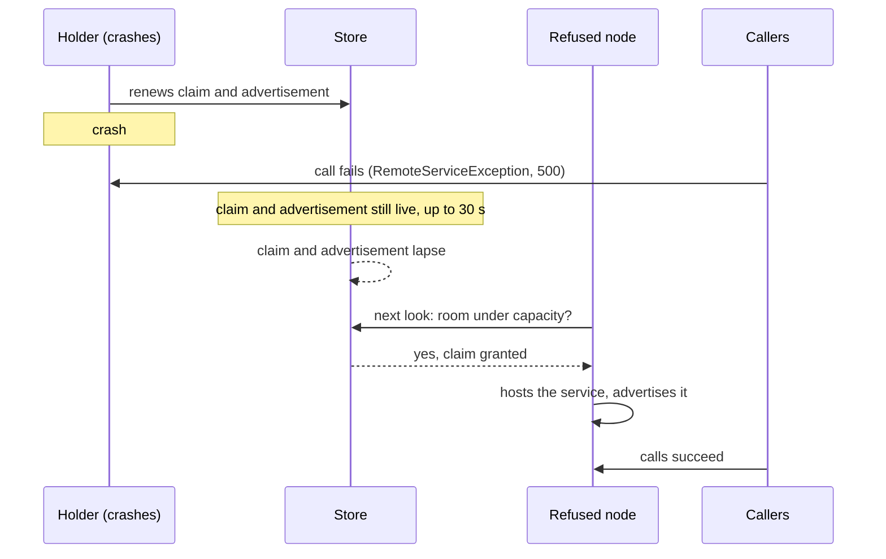
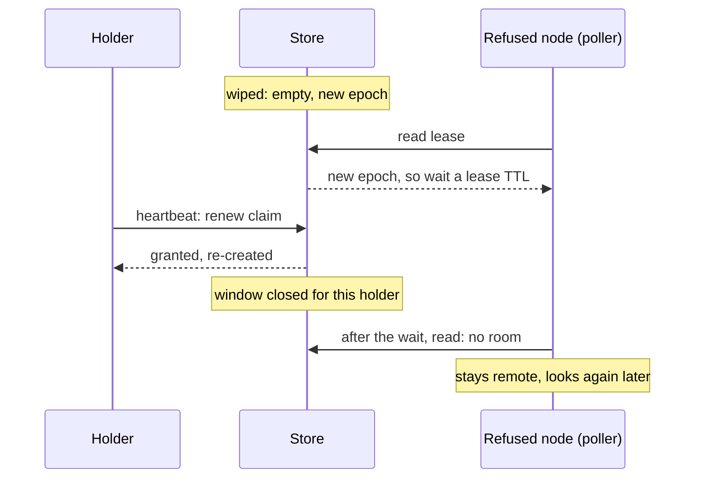
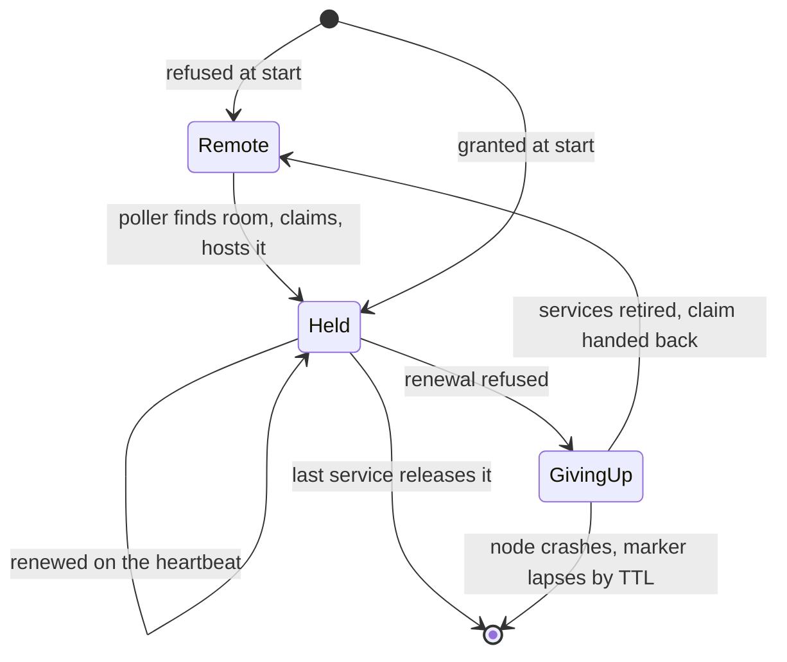

# Failure modes, vulnerable periods, and paths to recovery

What breaks in a Henge cluster, what is exposed while it is broken, for how long, and what brings it back.
[Gotchas](gotchas.md) is about the traps on the way from one process to many; this page is about what happens
once you are there and something fails.

Every entry answers the same three questions:

- **What is exposed?** What a caller, an operator or the cluster can see go wrong.
- **For how long?** The *vulnerable period*: from the failure until the cluster is whole again, as a number you
  can set an alert against, not "briefly".
- **What recovers it?** Who acts, with nobody deciding and nobody paged. Where nothing does, the entry says so.

## The rules that make recovery automatic

Every part of Henge that uses the [ephemeral store](guide/05-the-ephemeral-store.md) follows the same few
rules, and the recoveries below are all one of them:

1. **Everything expires, and its writer renews it.** A crashed process stops renewing, and its entries lapse on
   their own. Nothing has to notice a death.
2. **Anything may be lost, and the writer writes it again.** A wipe looks like early expiry. Every holder
   re-asserts its state on its next heartbeat; there is nothing to restore.
3. **While the store is away, sit still.** Keep the last answer, keep the leases and their resources, keep
   running. Where there is no last answer, be conservative: take less, or refuse.
4. **Fail honestly.** What can't be answered is a `503` (`StoreUnavailableException`), never a guess, and
   Henge never retries it. It retries only a call that provably never ran.
5. **Limits are soft, and wrong in one direction.** Capacities are an intentional underestimate of the real
   limit ([soft limits](guide/06-leases-and-rate-limits.md#soft-limits)), and the margin is what a vulnerable
   period lands in. A capacity set at the real limit leaves nothing for any of this.

## The clocks

The periods below are made of these. The defaults are in the
[configuration reference](reference/configuration.md).

| Clock | Default | What it times |
|---|---|---|
| Lease and run time to live | 30 s | How long a dead holder's claim stays. |
| Heartbeat | TTL / 3 = 10 s | How soon a holder re-asserts after a wipe. |
| Advertisement refresh | 10 s | How stale a caller's list of hosts can be. |
| Lease look (poll) | about 30 s, doubling to 5 min while the lease stays full | How soon a refused process takes up a lease with room. |
| Lease give-up grace and drain | 10 s and 30 s | How long a process that lost a lease keeps using it. |
| Store backoff | doubling to a cap (`henge.store.backoff.*`) | How soon a process asks a store that was away again. |
| Channel ping | `henge.channels` ping interval | How soon a silent peer is noticed: two intervals. |

## A process fails

| Failure | What is exposed | For how long | What recovers it |
|---|---|---|---|
| **A process stops gracefully** | Nothing. It withdraws its advertisements and hands its leases back, and its channels close `1012`. | None for calls. Clients on its channels reconnect. | The replacement claims the lease; clients reconnect and land elsewhere. |
| **A host of a service crashes, others host it too** | Calls to it fail to connect. | None for a caller: a call that couldn't connect fails over to the next advertised host. Its advertisement lapses within its time to live. | Failover, then expiry. |
| **A lease holder crashes** | The service it hosted has no host, but is still advertised: callers get `RemoteServiceException` (a `500`). | About a lease TTL (30 s), plus up to the refused processes' poll interval, longer if the lease has been full for a while. | The claim and the advertisement lapse; a refused process takes the lease up at its next look and hosts the service. |
| **A lease holder crashes and restarts at once** | The same. | The same: its replacement is refused like any other until the old claim lapses. | The same. |
| **A frontend dies** | The backend still holds its channels. | Two ping intervals if it vanished, none if it closed. | The backend's pings notice; each handler gets `onClose` with `1001`. |
| **A backend dies** | Its trunk drops. | The channels close `1011` at once; a backend that stops answering is noticed in two ping intervals. | Clients reconnect, to another backend. |
| **A scheduled job's node dies mid-run** | The run is lost. | The run claim lapses in 30 s, and the next fire runs it. | The next fire. **The run's progress is not recovered**: a job must be safe to run twice, and a long job keeps its own progress. |

The slow row is a lease holder that crashes. Nothing tells the others it is gone; its claim has to lapse:

Alert on the case the table doesn't heal fast: `henge.service.hosted` at `0` across the cluster for longer than
a lease TTL plus a poll interval.

## The store fails

### The store is away

A restart, a failover and a partition between the store and the nodes all look like this at first. A partition
is assumed to be global, so this is the case the design is built for: every node sees the store away together,
and nobody can gain what another is sitting on. Nothing fails over, nothing is torn down, and what cannot be
answered says so.

| Part | While it is away | What it costs |
|---|---|---|
| Calls to services | Go to the hosts last read. A host that fails is skipped until the next successful read, unless it is the only one. | A host that died during the outage is only skipped after a failed call. |
| Advertising | Heartbeats keep trying. | Nothing; an entry that lapses in a store that can't be read harms no one. |
| Leases | A process keeps its leases and their resources, and keeps trying to renew. It is never asked to give one up. | Nothing moves. A refused process stays remote. |
| Rate limits | Each process draws on a local bucket sized 1/N of the limit. | The cluster still holds to the limit, only coarser. Nodes that leave leave their share unused. A limit of fewer permits than nodes, or a node that became ready in the last heartbeat before the outage and isn't counted yet, can let a little too much through. A process can't join during the outage: it serves nothing until it has reached the store. |
| Scheduled jobs | A fire can't be claimed, and is counted `store-unavailable`. A run already going carries on. | **Fires during the outage are skipped, not caught up.** |
| Channels | Open channels never need the store and stay open. A new one to a backend with a known trunk still opens. | A new channel with no known backend fails `1013`. |
| Starting a process | It starts alive and **not ready**: every request but the health checks is a `503`. | It serves nothing until it has reached the store once; then it claims its leases and joins, with no restart. |
| A call that needs the store | `StoreUnavailableException`, a `503`. | Callers see an honest failure. |

**For how long:** as long as the store is away. Henge sets no deadline. A long outage degrades the cluster
rather than stopping it: nothing new is learned (a new process, a retired version), shares are frozen, and
leases only move to a process that was refused. **Alert on `henge.store.operations` with `outcome=error` and on
`henge.rate-limit.degraded`, and on nodes that stay not ready past their start period.** Restarting a
not-ready node does not help; the fix is the store.

**What recovers it:** the first operation to find the store back ends the outage, and every process re-writes
its advertisements, leases and limiter membership within a heartbeat (10 s). An outage longer than a lease TTL
has let every entry lapse, so it comes back as [an empty store](#the-store-comes-back-empty), one whose epoch
hasn't changed.

### The store comes back empty

A restart of the store is an outage followed by a wipe; a failover to a copy that missed writes is a wipe with
no outage. Callers read either as *a new epoch*. Two kinds of emptiness come with no new epoch, so nothing
below that depends on seeing one applies to them:

- **An outage longer than a lease TTL.** Every claim and advertisement lapsed while the store was away, which
  is expiry, not loss, so no store reports it. A refused process doesn't wait, and its first read may come
  before the holders' heartbeats.
- **A loss the store doesn't report.** The contract says it must report every one, and the stores Henge ships
  do, the Redis store's flushes and evictions included. A store that adds a way to lose data without
  extending its epoch falls here.

Both heal the same way as a wipe, by the give-up below; they only lose the wait that makes it rare.

| What is exposed | For how long |
|---|---|
| A read of the empty store may show no hosts. A caller that had seen hosts keeps them for one more interval when the store has a new epoch; an empty answer from the same store is believed at once. | One advertisement refresh. |
| **The store forgets who holds what, so a claim that fits the empty store is granted** whether it is a refused process's poll or a booting node's. The pool of a holder that has not re-asserted is open but untracked. | Until every holder has re-asserted: up to a heartbeat (10 s). A refused process that had read the lease before the reset waits a lease TTL after seeing the epoch change before it believes what it reads. |
| A holder whose claim another process took in that gap is refused on its next renewal, and **gives the lease up**. | About 40 s at the defaults: the grace and the drain, during which it still uses the pool. |

The window is the time before the holder's heartbeat. If the poller's claim had landed first, the holder's
renewal would be refused and it would give the lease up instead.

**What recovers it:** heartbeats re-assert; the epoch wait keeps pollers from taking room that is not free; a
holder that loses the race gives up the lease, and of several refused together only the first leaves. Measured
on three shop replicas, three wipes of Redis never held more than two claims. Earlier builds did over-commit, so
treat that as measured rather than guaranteed.

**What stays open:** a node that boots in the few seconds between the store resetting and its holders
re-asserting has no memory of the reset and can't wait. The margin below the real limit is what pays for it.
Anything that needs a hard guarantee (mutual exclusion, exactly-once) belongs in a system built on consensus,
not in the ephemeral store.

### One node is cut off from the store

The node sits still as above and renews when it can. If its claim lapsed and another node was granted the
capacity, the cluster is over capacity until the partition heals; then the cut-off node's renewal is refused
and it gives the lease up. **The overlap lasts as long as the partition**, not a lease TTL: the cut-off node sits still by design, and
only a refused renewal, which needs the store to answer, ends it. Then add the give-up grace and drain. Henge
assumes partitions are global, cutting every node off together, as the networks it is deployed in do; a partial
one is the rare exception, repaired at the heal and not prevented (see
[partition tolerance](design/partition-tolerance.md)). A scheduled job
is similar: the cut-off node's run claim lapses, and if the job's next fire comes during the partition, another
node is given the run. Two may then run until the refused renewal interrupts the first, or its `maxRuntime`
(an hour by default) does. A rate limit lets through the cut-off node's local share on top of the whole limit,
which the rest still share in the store.

## A lease can't be kept

| Cause | What happens | Recovery |
|---|---|---|
| **The capacity changed in a rollout.** New nodes are configured with a larger one. | The old holders that now see the cluster over their own capacity are refused, and give the lease up, one at a time. Every request in the test was answered. | The services move to a node that is not refused; the old node is a candidate again. |
| **A claim was lost** (it lapsed, or the store was wiped and another node claimed the capacity). | The same give-up. | The same. |
| **A node is refused its lease at start.** | The service is reached remotely and the node is a candidate. | It takes the lease up when it has room, looking again later each time the lease stays full. |
| **A node crashes while giving up.** | Its "being given up" claim stays. | It lapses with its time to live. |
| **The service can't be built after a lease is granted.** | The claim is handed back and the node stays a candidate with backoff. | The poller tries again. |

Giving a lease up is, in order: stop advertising, wait the grace, switch the service to the network, give the
calls running the drain timeout, destroy the implementation (closing the pool), and hand the claim back.
[Giving a lease up](guide/06-leases-and-rate-limits.md#giving-a-lease-up) has the detail.

## A call fails

| Failure | What Henge does | What is yours |
|---|---|---|
| The connection can't be made, or the answer is `404` | Retried, up to 3 attempts, on the next advertised host. A `404` means nothing ran. | Nothing. |
| A read timeout (10 s), a `5xx`, an exception the method threw | **Not retried.** The call may have run. | Whether repeating it is safe depends on the method. |
| `StoreUnavailableException` / `503` | Not retried: it says the cluster is in trouble, which another try won't fix. | What a `503` means to your clients, and whether they retry. |
| A hung dependency | The 2 s connect and 10 s read timeouts stop it holding a thread for ever. | The same timeouts on your own clients. |

## Where recovery isn't finished

These are known, and are the work of the [lease healing](design/lease-healing.md) design. Until it is built,
each is a path that **does not heal by itself**:

- **A lease eviction that fails part-way is never retried.** If the store blips while an advertisement is being
  withdrawn, the failure is logged and the service stays hosted, unadvertised, on a lease the cluster has written
  off, with its "being given up" marker written for ever. If it blips while the claim is handed back, the service
  is given up but never becomes a candidate again, so this process never hosts it again. Restarting the process
  clears either.
- **A refusal that lands just before a service registers its eviction** runs no eviction, with the same result.
- **A heartbeat or poller that dies from an unexpected error stops without a sound.** The lease heartbeat, the
  lease poll and the advertisement refresh each end their schedule if one run throws something they don't catch,
  in practice an `Error`.
  A process whose leases are no longer renewed lapses out of the cluster; a process that no longer polls stays
  remote. Alert on `henge.service.hosted`, and on advertisements that stop being renewed.

## What no recovery covers

- **Frequent or long partial partitions.** A cluster assumes partitions are global: the store is away for every
  node at once. A partial one (some nodes cut off, or the store reachable but a peer not) is handled as a rare
  event whose cost is an overlap bounded only by its length
  ([partition tolerance](design/partition-tolerance.md)).
- **Running across regions, or zones that partition routinely.** That is global redundancy, built as clusters of
  clusters: a layer above this one, not yet designed. One cluster never stretches its store across a WAN.
- **A store that stays away.** The cluster degrades and says so; it does not fix itself, and nobody decides when
  to stop.
- **A capacity at the real limit.** The margin pays for every vulnerable period on this page.
- **State kept in a service's memory.** It is lost with the process, and Henge doesn't detect it yet
  ([roadmap](scope.md#roadmap)).
- **A job that outlives its node.** It is interrupted at `maxRuntime`, or when its run claim is lost, and runs
  again from the start unless you batch it.
- **A replicated monolith that shares no store.** It looks like a single process, so each replica runs every
  fire and holds every lease. [A split needs a store](guide/04-splitting.md#a-split-needs-a-store).

## Watching for all of it

| Meter | Says |
|---|---|
| `henge.store.operations`, `outcome=error` | The store is away. |
| `henge.rate-limit.degraded` | Rate limits are answering from their local share. |
| `henge.service.hosted` | A service nobody hosts, at `0` across the cluster, for longer than a lease TTL plus a poll interval. |
| `henge.scheduled.fires`, `outcome=store-unavailable` or `duplicate` | Fires lost to an outage, or won twice during a failover. |
| `henge.scheduled.interruptions` | A run stopped by `max-runtime` or a lost claim. |

[Observability](reference/observability.md) has the full list, and
[Operating](guide/07-operating.md#when-the-store-goes-away) what to alert on.
